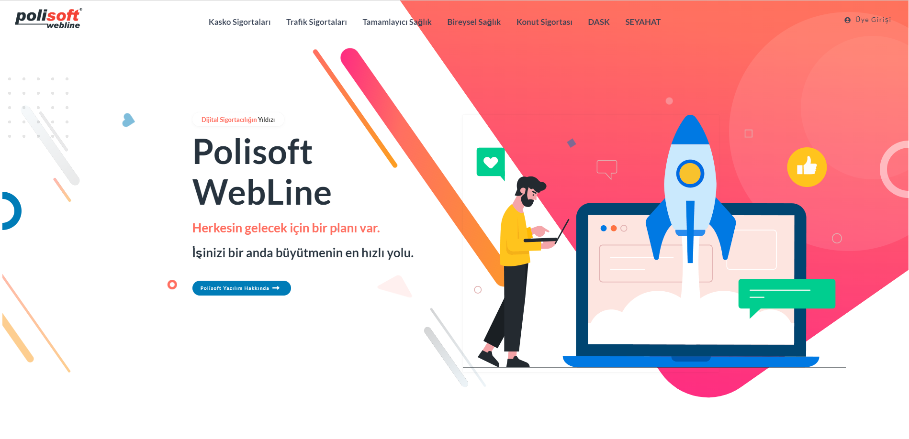
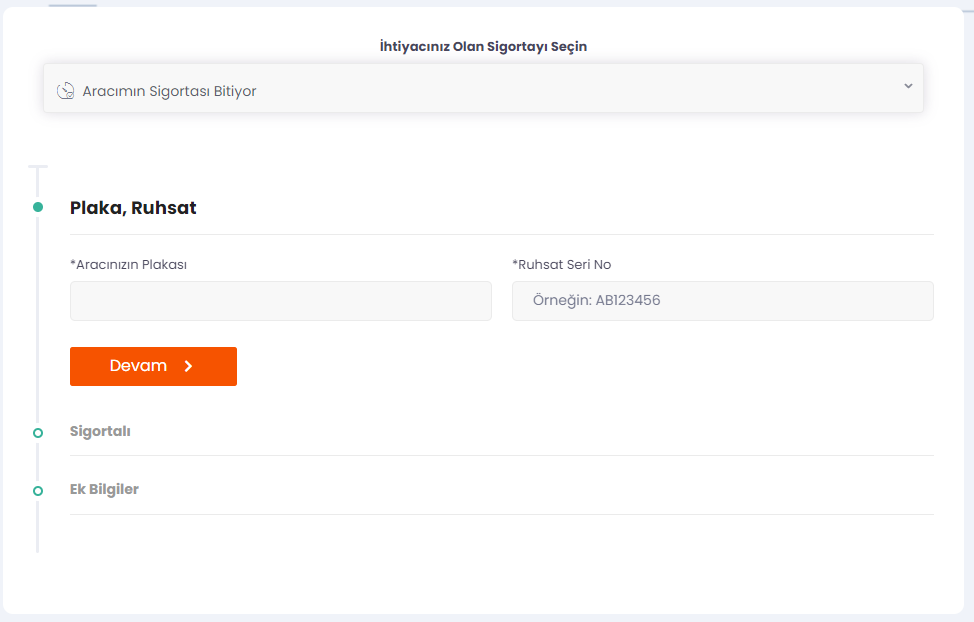
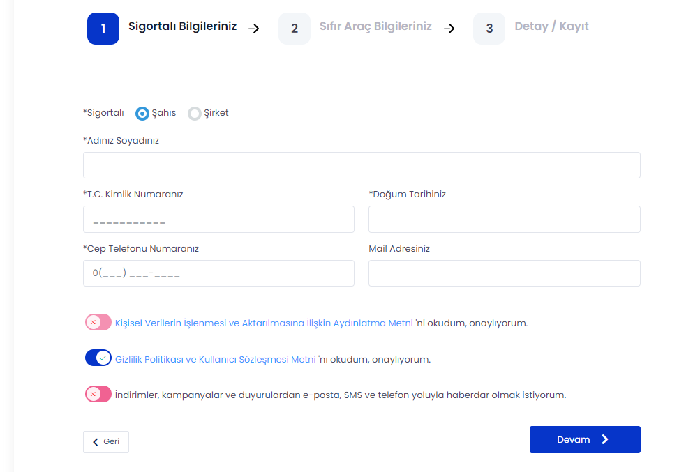
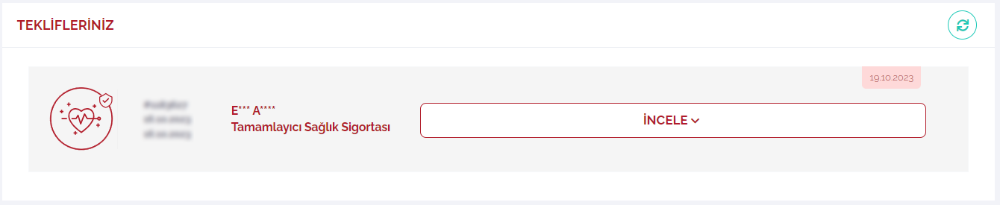
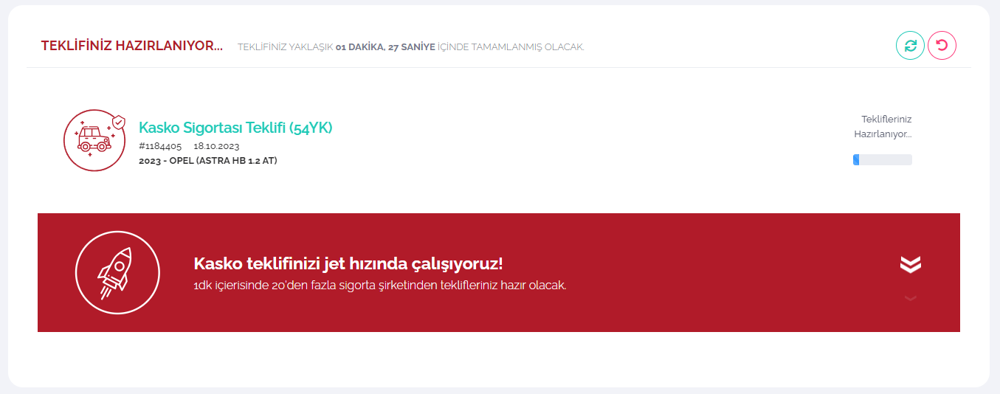
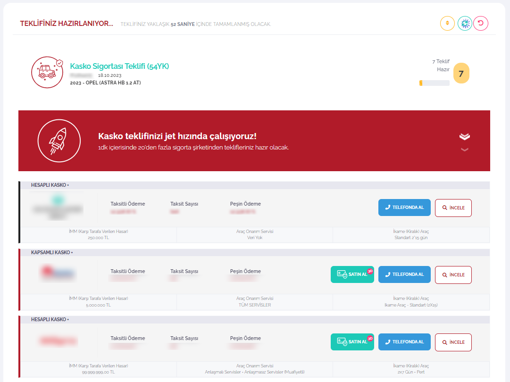
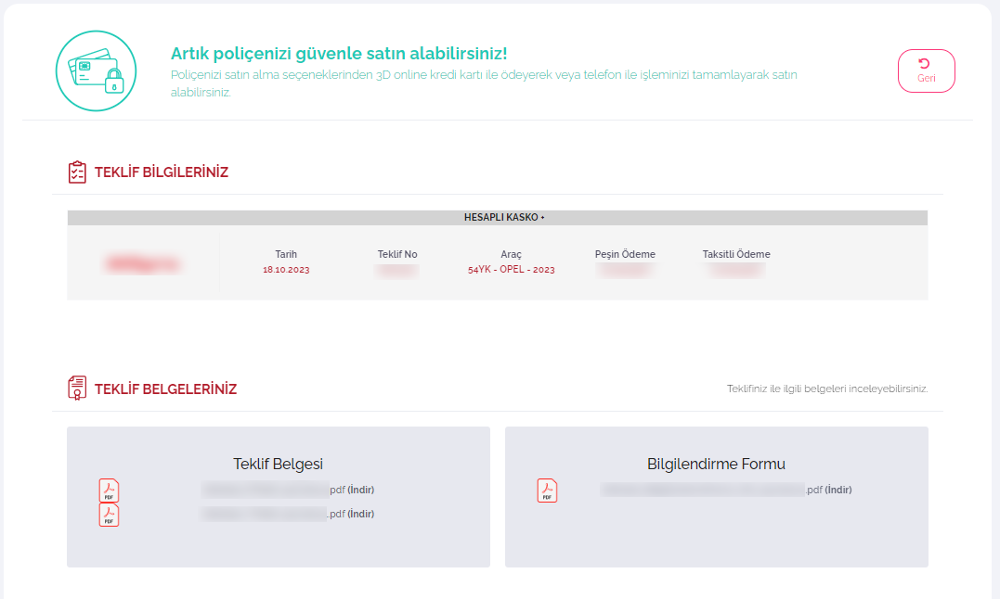
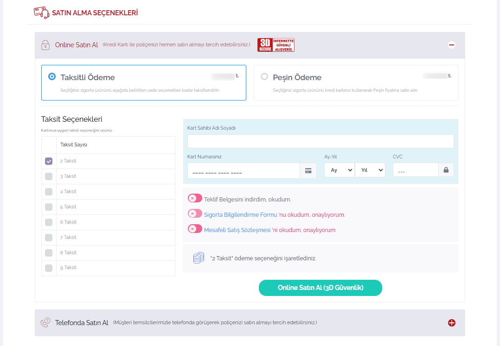

# Polisoft WebLine: Dijital Sigortacılığın Yıldızı
> Polisoft WebLine Tasarım Dokümantasyonu V1.0, Son Güncelleme: 18.10.2023

### Polisoft WebLine Nedir?
Polisoft WebLine; sigortacılık sektöründe ürünlerinizi müşterilerinize online ortamda ulaştırmanızı sağlayan, dijital sigortacılık süreçlerini tüm hatlarıyla yöneten, tasarımını dilediğiniz şekilde gerçekleştirebileceğiniz bir web sitesi aracı içeren websitesi çıktısıdır. Müşterileriniz anında online teklif alırlar, kendileri için en iyi teklifi seçerler ve seçtikleri poliçeleri güçlü ve güvenli ödeme altyapısı ile güvenle öderler. Diledikleri zaman Kullanıcı Girişi yaparak geçmiş tekliflerini görüntülerler, poliçelerine ulaşırlar ve PDF olarak indirirler.

> Bu dokümantasyon, Polisoft WebLine ürününün `Tasarım Araçlarını` anlatmaktadır. 

> Sigortacılık süreçlerine ilişkin tüm ayarlarınız müşteri temsilciniz yardımıyla yapılandırılacaktır.

#### Uygulamadan Görüntüler:

> Sorularınız için:
info@polisoft.com.tr adresine eposta gönderebilirsiniz.

> Polisoft Yazılım © 2023 | Tüm Hakları Saklıdır.