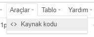

# Header Ayarları

> WebLine Ayarları > Header Ayarları bölümünden web sitenizin üst kısmındaki Header alanını düzenleyebilirsiniz. 

 Bu kısımda 2 header seçeneği bulunmaktadır. Header ve Top Header konumları görseldeki gibidir: 
 

 

 Header üzerinde varsayılan olarak Logo, GSM, WhatsApp, E-Posta, Kullanıcı İşlemleri, Dil Seçimi, Duyuru, Menü seçenekleri bulunur. 

<ol>
<li> Logo: Site Ayarları'ndan Yüklenen Logonun konumu bu kısımdan ayarlanır.</li>
<li> GSM, WhatsApp, E-Posta: `Site Ayarları > İletişim Bilgileri` sekmesinden girilen iletişim bilgileri Header üzerinde ayrı ayrı konumlandırılabilirler.</li>
<li> Kullanıcı İşlemleri: Sigortalı'nın `Kullanıcı Giriş ve Çıkış işlemlerini` gerçekleştiren butonlar bu kısımdan konumlandırılır.</li>
</ol>

 

> Header görünümü `Desktop, Tablet ve Mobil` çözünürlükleri için ayrı ayrı ayarlanabilirler. Sistem otomatik olarak cihazınızı ve çözünürlüğü algılayacak ve gösterilmesi gereken Header dizaynına karar verecektir.

> Varsayılan seçenekler yeterli değilse <b>Hızlı Menü</b> adı verilen HTML içerik girilebilen header özelliği de kullanılabilir. (Örneğin; Header'a custom html kod yerleştirmek istiyorsanız bu özelliği tercih edebilirsiniz.)

Bu özelliği kullanmak için `Webline Ayarları > Hızlı Menü` ekranına gidin. Tip olarak `Başlık İçerik` seçin.

 Editör üzerindeki `Araçlar > Kaynak Kodu` alanını kullanarak HTML kodunuzu kopyalayabilirsiniz. 

 Hızlı Menü'nüzü kaydettikten sonra Header veya Top Header Ayarları bölümüne giderek en alttan oluşturduğunuz Hızlı Menüyü seçmeli ve bir konum belirlemelisiniz. 

<h3>Sonuç</h3>

Aşağıdaki görselde HTML kullanılarak Header'a yerleştirilen ve sağa konumlandırılan ARA ve WHATSAPP butonlarını görebilirsiniz. 

