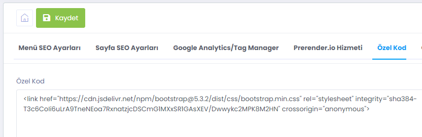
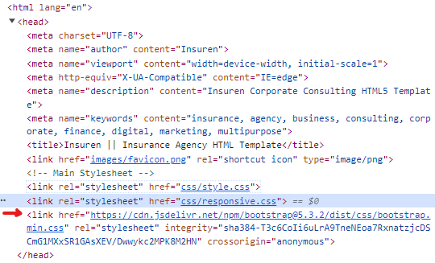
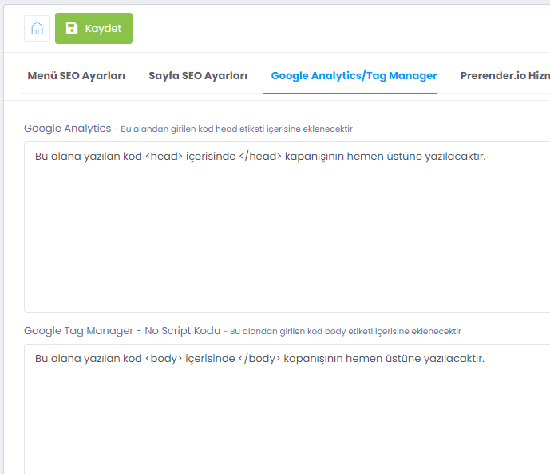
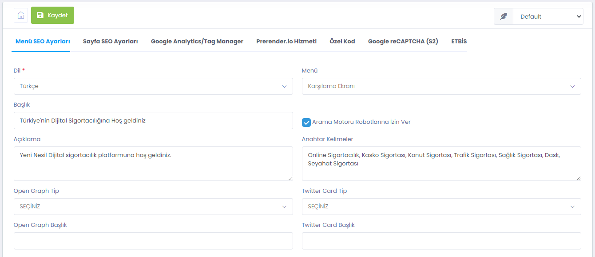
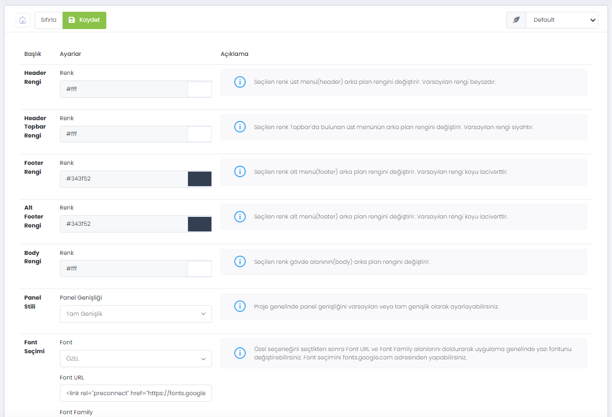
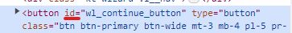
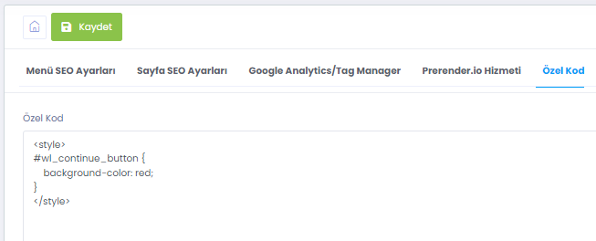

# HTML Özellikleri

> `<head>` tagı içeriği

 WebLine sisteminde WebLine Ayarları > Seo Ayarları > Özel Kod bölümünü kullanarak `head` içerisine style, script, meta gibi html elementlerini yazabilirsiniz. 

Üsttekine benzer bir içerik girişi sonucu; web sitenizdeki `<head>` alanının çıktısı aşağıdaki şekilde olacaktır:  

 
Bu yöntemi kullanarak custom css ve js kütüphanelerinizi site genelinde kullanabilirsiniz. Ayrıca; Genel Ayarlar'da yer alan <b>Medya Kütüphanesi</b> modülümüz aracılığıyla dosyalarınızı upload edebilir ve web sayfasında dilediğiniz kısımda kullanabilirsiniz.

> `<body>` tagı içeriği

 WebLine sisteminde WebLine Ayarları > Seo Ayarları > Google Analtyics/Tag Manager bölümünü kullanarak `head` ve `body` içerisine style, script, meta gibi html elementlerini yazabilirsiniz. Bu kısım her ne kadar Google Analtyics veya Google Tag Manager olarak isimlendirilmiş olsa da her türlü element kullanımına açıktır.

> Meta Ayarları ve Arama Motoru Bot Erişimlerinin Yönetilmesi

 WebLine sistemi size Head içerisindeki meta bilgileri düzenlemeniz için kolaylık sağlamaktadır. Bunun için içerik yönetim panelinde WebLine Ayarları > Seo Ayarları > Menü SEO Ayarları bölümünü kullanabilirsiniz. Dil Seçimi yaptıktan sonra hangi ekran üzerinde çalışacağınızı seçerek meta bilgilerini düzenleyebilir ve Arama Motoru izinlerini yönetebilirsiniz.

> Web sitenizin font, body, header rengi gibi genel stil ayarlarını WebLine Ayarları > Stil Ayarları bölümünden gerçekleştirebilirsiniz. 

> WebLine sistemi içerisinde yer alan neredeyse tüm HTML bileşenler DOM üzerinde bir ID'ye sahiptir. Bu ID'ler kullanılarak bileşenleri modifiye edebilirsiniz.  
  
  
  
