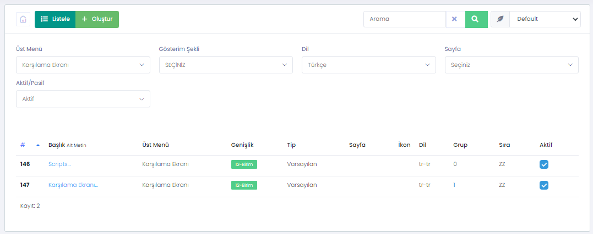
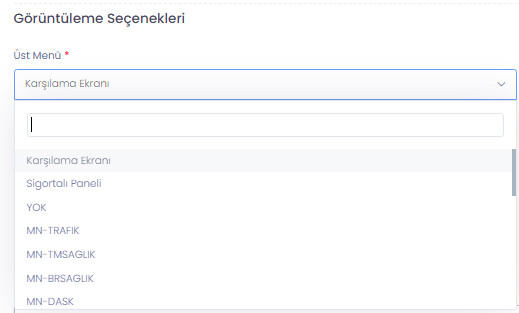
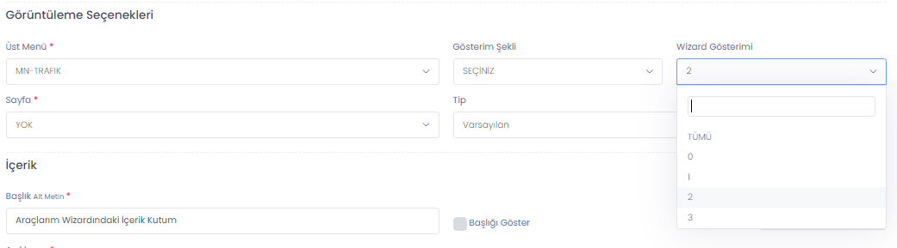
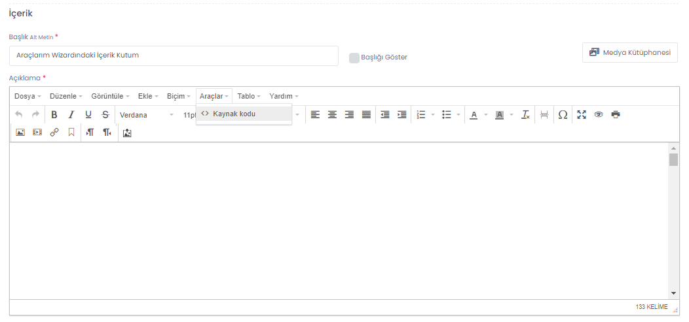
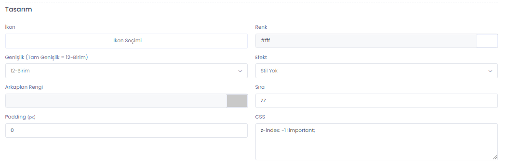
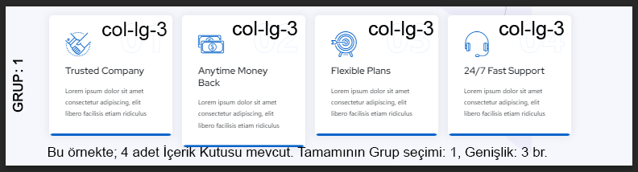

# İçerik Kutuları

> Web sayfanıza yerleştirmek istediğiniz tüm HTML içerikler bu kısımdan yönetilir. İçerik Kutuları'na erişmek için `WebLine Ayarları > İçerik Kutuları` menüsünü takip edebilirsiniz.

> İçerik Kutuları sitenin bütünün birer parçasıdırlar. Web sitesi genelinde parçalar halinde menülere veya sayfalara eklenerek genel görüntü oluşturulur.

> İçerik Kutusu oluşturulurken şu ayarları belirlemelisiniz;

<ol>
<li>Yetki (Görüntüleme): İçerik Herkese Gösterilir, Yalnızca Misafir Kullanıcılara veya Yalnızca Sisteme Üye Girişi yapan kullanıcılara gösterilir.</li>
<li>İçerik Kutusu Tipi: Standart HTML İçeriği. Veya Sık Sorulan Sorular içeriği olarak iki seçenek vardır. SSS seçimi yapmanız durumunda sizden hangi sayfa ile bağlantı kurulacağı sorulur.</li> 
</ol>

> İçerik Kutusunun bağlı olduğu ekranı seçmelisiniz.  

> Bir ürün seçimi yaptıysanız içerik kutusunu Ürün Teklif Formundaki herhangi bir Wizard'a ekleyebilirsiniz. 

> HTML içeriği Editör üzerinden Kaynak Kodu aracılığıyla yerleştirebilirsiniz. Görseller ve diğer medya öğeleri için Medya Kütüphanesini kullanmalısınız. Editör üzerinde yer alan Upload özelliği ile `Base64` yükleme gerçekleştirebilirsiniz. Kaynak Kodu alanına `<style>` ve `<script>` taglarını da yazabilirsiniz. Böylece sistem genelinde (Özel Kod) kullanmak istemediğiniz kütüphaneleri veya CSS'leri yalnızca bu içerik kutusuna özel olacak şekilde kullanabilirsiniz. 

> İçerik Kutularının CSS/stil özelliklerini üstteki HTML alanından elle düzenleyebilir veya WebLine'ın Tasarım kategorisi altındaki seçenekleri kullanarak gerçekleştirebilirsiniz.  

> Bu kısımda yer alan `Grup` seçeneği sayfadaki her bir `row`'u temsil ederken; `Sıralama` ise aynı gruba dahil edilen içerik kutularının kendi aralarındaki sıralamayı temsil etmektedir.

