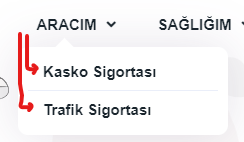

# Menü Tasarımı ve Ürünler

> WebLine, kullanıcılarınızın menüler aracılığıyla sigorta ürünlerinize veya sayfalarınıza ulaşmalarını sağlar. Bir kez sitenizde satışını gerçekleştireceğiniz sigorta ürünlerine karar verdikten sonra bunların nasıl sunulacağını, görünümünü, UIX kapsamında en uygun şekilde son kullanıcıya nasıl ulaştırılabileceğine karar vermelisiniz.

<h4> Bazı örnekler; </h4>

 &nbsp;
 &nbsp;
 &nbsp;

> Menülerinizi yönetmek için WebLine Ayarları > Menüler bölümüne gidin. Liste üzerinde mevcut menülerinizi görebilirsiniz.

> Listenin sonundaki Aktif/Pasif işaret kutusunu kullanarak herhangi bir menüyü eş zamanlı olarak sitenizden gizleyebilirsiniz. 

> Yeni bir menü oluştururken bu menü için bir URL tanımlamalısınız. Bu URL ilgili ekran açıldığı zaman tarayıcı üzerinde görüntülenecek olan adrestir. 

> Menü, Ürün ve Sayfa kategorisi altında Polisoft Sistemleri üzerinden panele iletilen Ürünler yer almaktadır. Oluşturmak istediğiniz menüyü bir sigorta ürününe bağlamak için bu seçim kutusunu kullanmalısınız.  

> `Ürün, Sayfa ve Üst Menü` alanlarını boş bırakarak bir menü oluşturur ve diğer menülerin `Üst Menü` seçimine bu oluşturduğunuz boş menüyü atarsanız Üst > Alt menü görünümü elde edersiniz. 

> Oluşturacağınız menü için dil karşılıklarını/başlıkları Dil seçimine göre yazmanız gerekmektedir. Bunun için `Dil Karşılıkları` sekmesinden Başlık ve Açıklama alanlarını doldurmalısınız. 

> Menülerin stil ayarlarına Menü Stilleri sekmesinden görüntüleyebilirsiniz. Bu ayarları kullanarak menülerinizi özelleştirebilirsiniz. 
