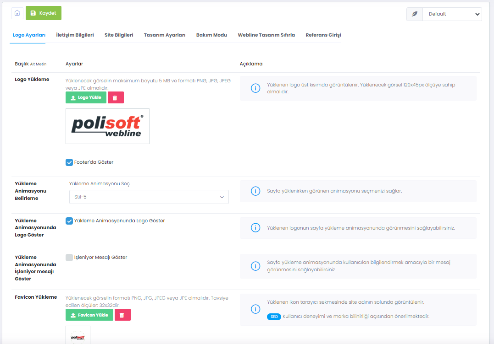

# Site Ayarları

> Web sitenizin genel ayarlarını Site Ayarları bölümünden yönetebilirsiniz. Burada şirket bilgileriniz, logo, preloader seçimi, Bakım Modu, Polisoft sistemleriyle bağlantı kurmak için kullanacağız Kod bilgileri gibi ayarlar yer almaktadır.

