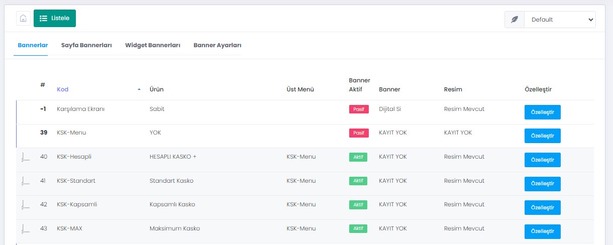
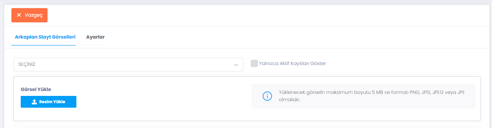
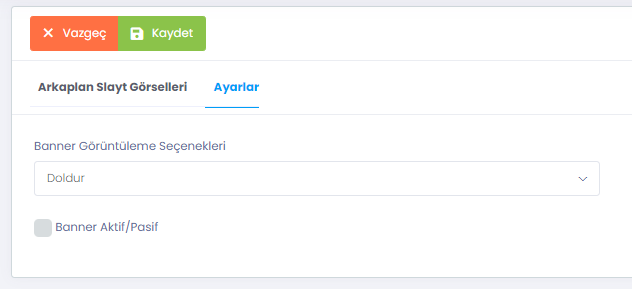
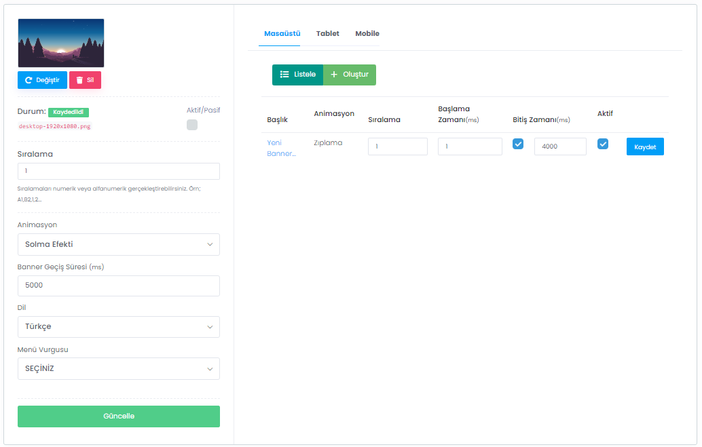
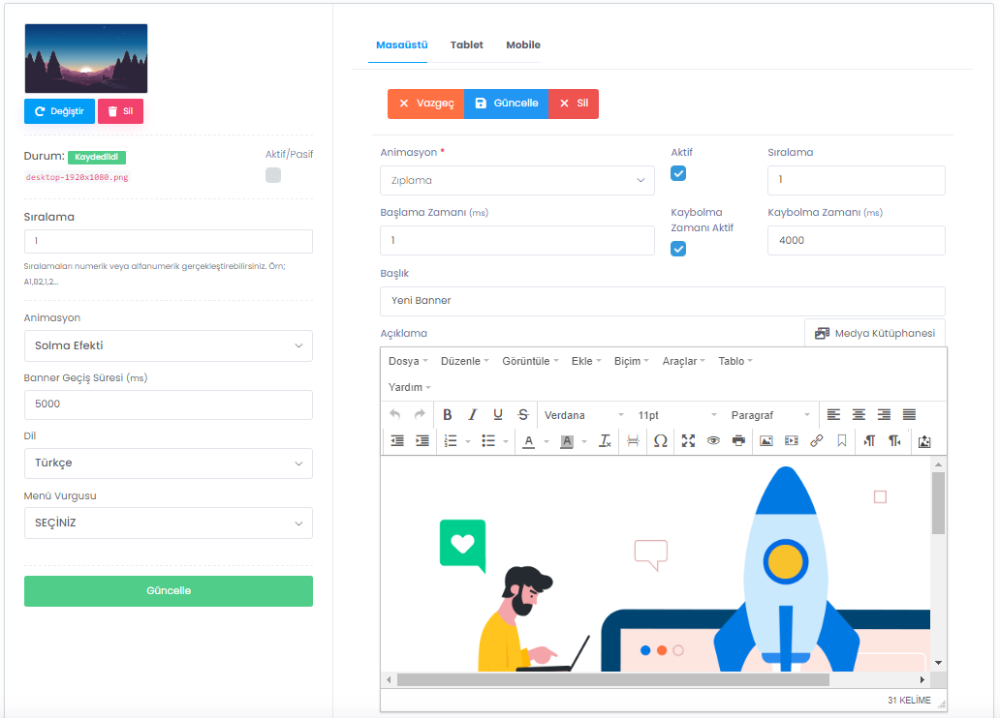

# Slider / Banner Tasarımı

> WebLine, oluşturduğunuz tüm sayfa ve menülere Slider/Banner yerleştirmenize olanak tanır.

> Bannerlar Listesi üzerinde şuana kadar eklediğiniz tüm Menüler, Sayfalar ve Widgetlar listelenir. Herhangi biri üzerinde işlem yapmak için satırın en sağında bulunan `Özelleştir` butonu kullanılır.

> Özelleştirme ekranında şu işlemler yapılabilir:
<ol>
<li> Seçilen ekrana ait banner görselleri yüklenebilir.</li>
<li> Bu görseller için animasyonlar ve ekranda kalma süreleri gibi opsiyonlar ayarlanabilir.</li>
<li> Masaüstü, Tablet ve Mobil için ayrı ayrı olmak üzere görsel üzerinde yer alacak yazı ve içeriklere karar verilebilir.</li>
<li> Bu içeriklerin animasyonları ve geçiş süreleri gibi opsiyonlar ayarlanabilir.</li>
<li> Yüklenen görseller için Banner Görüntüleme seçenekleri seçilebilir. (Doldur, Kapla gibi..) </li>
</ol>

