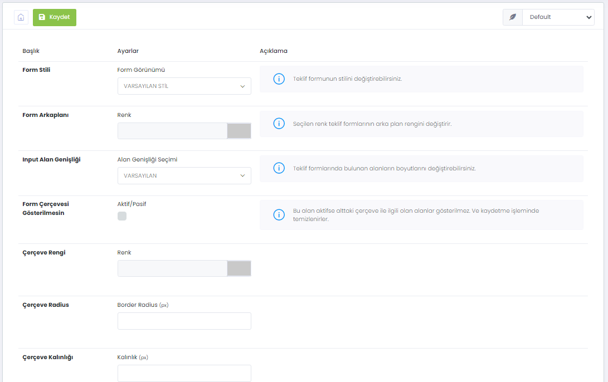

# Teklif Formları

> WebLine sistemi, eğer bir menüye ürün bağladıysanız, ürün branşına göre teklif formlarını otomatik oluşturur. Bu formlar üzerinde tasarımsal düzenlemeleri panel üzerinden yapmanıza da izin verir. Ancak formların akışı ve wizardlar yasal zorunluluklara göre ayarlandığından form stepleri ve akışlar ile ilgili herhangi bir değişiklik yapılamaz. `WebLine Ayarları > Form Stil Ayarları` bölümünden Formlarınızla ilgili tasarımsal özelleştirmeleri gerçekleştirebilirsiniz.
 

 Bu akranda şu tasarım seçenekleri yer almaktadır: 

<ol>
    <li>Form Stili</li>
    <li>Form Görünümü</li>
    <li>Form Arkaplanı</li>
    <li>Renk</li>
    <li>Input Alan Genişliği</li>
    <li>Alan Genişliği Seçimi</li>
    <li>Form Çerçevesi Gösterilmesin</li>
    <li>Çerçeve Rengi</li>
    <li>Çerçeve Radius</li>
    <li>Çerçeve Kalınlığı</li>
    <li>Çerçeve Gölgesi Gösterilmesin</li>
    <li>Form Alanı Boşluğu</li>
    <li>Ürün Seçiminde Devam Butonu</li>
    <li>Wizard Navigasyon Rengi</li>
    <li>Form Başlığı Ayraç Rengi</li>
    <li>Form Alanı Ayraç Rengi</li>	
    <li>Ürün Seçimi Rengi</li>
    <li>Teminat Formu Çerçeve Rengi</li>	
    <li>Teminat Formu Başlık Rengi</li>
</ol>

